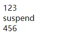
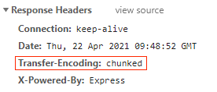
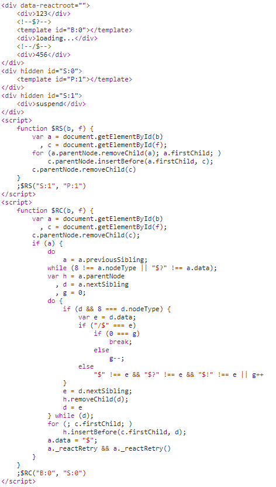

## react-fizz-demo

based on react@17.0.3.

### setup

```bash
yarn
yarn setup
yarn dev
yarn clean
```

### What's happen

- async operation doesn't block the stream
- in server side, you dont have to prefetch data in `getServerSideProps` (Nextjs).

jsx (src/render.js)

```jsx
export default function render() {
  return (
    <div>
      <div>123</div>
      <Suspense fallback={<div>loading...</div>}>
        <Suspend />
      </Suspense>
      <div>456</div>
    </div>
  );
}
```

At the begining


After the 3 seconds



chrome devtools



dom


